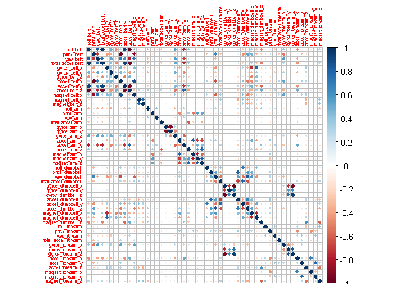
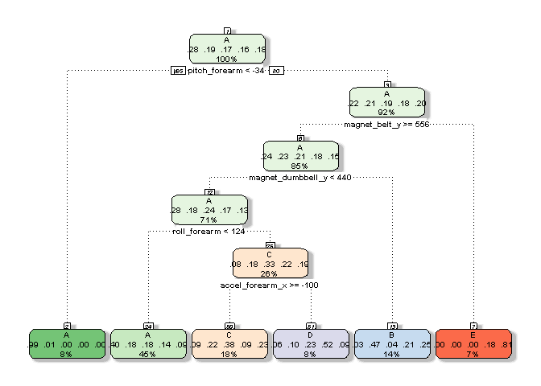
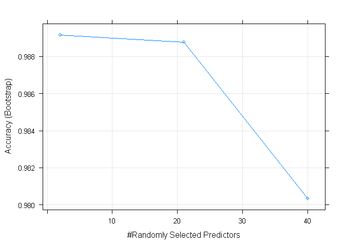
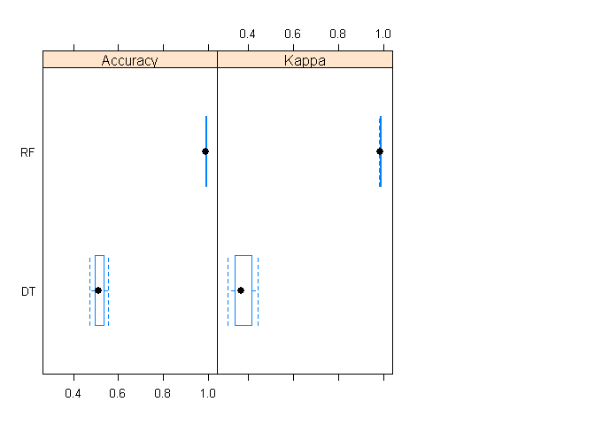

# Activity Prediction
Vadim Zaigrin  

## Synopsis

Using devices such as Jawbone Up, Nike FuelBand, and Fitbit it is now possible to collect a large amount of data about personal activity relatively inexpensively. These type of devices are part of the quantified self movement - a group of enthusiasts who take measurements about themselves regularly to improve their health, to find patterns in their behavior, or because they are tech geeks. One thing that people regularly do is quantify how much of a particular activity they do, but they rarely quantify how well they do it.

In this project we will use data from accelerometers on the belt, forearm, arm, and dumbell of 6 participants. They were asked to perform barbell lifts correctly and incorrectly in 5 different ways. More information is available from the website here: http://groupware.les.inf.puc-rio.br/har (see the section on the Weight Lifting Exercise Dataset). 

## Load and Clean Data

The data for this project comes from this source: http://groupware.les.inf.puc-rio.br/har.

* Load data.


```r
file1<-"pml-training.csv"; url1<-"http://d396qusza40orc.cloudfront.net/predmachlearn/pml-training.csv"
file2<-"pml-testing.csv"; url2<-"http://d396qusza40orc.cloudfront.net/predmachlearn/pml-testing.csv"

if ( !file.exists(file1) )  download.file(url1,destfile=file1)
if ( !file.exists(file2) )  download.file(url2,destfile=file2)

train.orig<-read.csv(file1)
test.orig<-read.csv(file2)
```

* Examine data


```r
str(train.orig)
```

```
## 'data.frame':	19622 obs. of  160 variables:
##  $ X                       : int  1 2 3 4 5 6 7 8 9 10 ...
##  $ user_name               : Factor w/ 6 levels "adelmo","carlitos",..: 2 2 2 2 2 2 2 2 2 2 ...
##  $ raw_timestamp_part_1    : int  1323084231 1323084231 1323084231 1323084232 1323084232 1323084232 1323084232 1323084232 1323084232 1323084232 ...
##  $ raw_timestamp_part_2    : int  788290 808298 820366 120339 196328 304277 368296 440390 484323 484434 ...
##  $ cvtd_timestamp          : Factor w/ 20 levels "02/12/2011 13:32",..: 9 9 9 9 9 9 9 9 9 9 ...
##  $ new_window              : Factor w/ 2 levels "no","yes": 1 1 1 1 1 1 1 1 1 1 ...
##  $ num_window              : int  11 11 11 12 12 12 12 12 12 12 ...
##  $ roll_belt               : num  1.41 1.41 1.42 1.48 1.48 1.45 1.42 1.42 1.43 1.45 ...
##  $ pitch_belt              : num  8.07 8.07 8.07 8.05 8.07 8.06 8.09 8.13 8.16 8.17 ...
##  $ yaw_belt                : num  -94.4 -94.4 -94.4 -94.4 -94.4 -94.4 -94.4 -94.4 -94.4 -94.4 ...
##  $ total_accel_belt        : int  3 3 3 3 3 3 3 3 3 3 ...
##  $ kurtosis_roll_belt      : Factor w/ 397 levels "","-0.016850",..: 1 1 1 1 1 1 1 1 1 1 ...
##  $ kurtosis_picth_belt     : Factor w/ 317 levels "","-0.021887",..: 1 1 1 1 1 1 1 1 1 1 ...
##  $ kurtosis_yaw_belt       : Factor w/ 2 levels "","#DIV/0!": 1 1 1 1 1 1 1 1 1 1 ...
##  $ skewness_roll_belt      : Factor w/ 395 levels "","-0.003095",..: 1 1 1 1 1 1 1 1 1 1 ...
##  $ skewness_roll_belt.1    : Factor w/ 338 levels "","-0.005928",..: 1 1 1 1 1 1 1 1 1 1 ...
##  $ skewness_yaw_belt       : Factor w/ 2 levels "","#DIV/0!": 1 1 1 1 1 1 1 1 1 1 ...
##  $ max_roll_belt           : num  NA NA NA NA NA NA NA NA NA NA ...
##  $ max_picth_belt          : int  NA NA NA NA NA NA NA NA NA NA ...
##  $ max_yaw_belt            : Factor w/ 68 levels "","-0.1","-0.2",..: 1 1 1 1 1 1 1 1 1 1 ...
##  $ min_roll_belt           : num  NA NA NA NA NA NA NA NA NA NA ...
##  $ min_pitch_belt          : int  NA NA NA NA NA NA NA NA NA NA ...
##  $ min_yaw_belt            : Factor w/ 68 levels "","-0.1","-0.2",..: 1 1 1 1 1 1 1 1 1 1 ...
##  $ amplitude_roll_belt     : num  NA NA NA NA NA NA NA NA NA NA ...
##  $ amplitude_pitch_belt    : int  NA NA NA NA NA NA NA NA NA NA ...
##  $ amplitude_yaw_belt      : Factor w/ 4 levels "","#DIV/0!","0.00",..: 1 1 1 1 1 1 1 1 1 1 ...
##  $ var_total_accel_belt    : num  NA NA NA NA NA NA NA NA NA NA ...
##  $ avg_roll_belt           : num  NA NA NA NA NA NA NA NA NA NA ...
##  $ stddev_roll_belt        : num  NA NA NA NA NA NA NA NA NA NA ...
##  $ var_roll_belt           : num  NA NA NA NA NA NA NA NA NA NA ...
##  $ avg_pitch_belt          : num  NA NA NA NA NA NA NA NA NA NA ...
##  $ stddev_pitch_belt       : num  NA NA NA NA NA NA NA NA NA NA ...
##  $ var_pitch_belt          : num  NA NA NA NA NA NA NA NA NA NA ...
##  $ avg_yaw_belt            : num  NA NA NA NA NA NA NA NA NA NA ...
##  $ stddev_yaw_belt         : num  NA NA NA NA NA NA NA NA NA NA ...
##  $ var_yaw_belt            : num  NA NA NA NA NA NA NA NA NA NA ...
##  $ gyros_belt_x            : num  0 0.02 0 0.02 0.02 0.02 0.02 0.02 0.02 0.03 ...
##  $ gyros_belt_y            : num  0 0 0 0 0.02 0 0 0 0 0 ...
##  $ gyros_belt_z            : num  -0.02 -0.02 -0.02 -0.03 -0.02 -0.02 -0.02 -0.02 -0.02 0 ...
##  $ accel_belt_x            : int  -21 -22 -20 -22 -21 -21 -22 -22 -20 -21 ...
##  $ accel_belt_y            : int  4 4 5 3 2 4 3 4 2 4 ...
##  $ accel_belt_z            : int  22 22 23 21 24 21 21 21 24 22 ...
##  $ magnet_belt_x           : int  -3 -7 -2 -6 -6 0 -4 -2 1 -3 ...
##  $ magnet_belt_y           : int  599 608 600 604 600 603 599 603 602 609 ...
##  $ magnet_belt_z           : int  -313 -311 -305 -310 -302 -312 -311 -313 -312 -308 ...
##  $ roll_arm                : num  -128 -128 -128 -128 -128 -128 -128 -128 -128 -128 ...
##  $ pitch_arm               : num  22.5 22.5 22.5 22.1 22.1 22 21.9 21.8 21.7 21.6 ...
##  $ yaw_arm                 : num  -161 -161 -161 -161 -161 -161 -161 -161 -161 -161 ...
##  $ total_accel_arm         : int  34 34 34 34 34 34 34 34 34 34 ...
##  $ var_accel_arm           : num  NA NA NA NA NA NA NA NA NA NA ...
##  $ avg_roll_arm            : num  NA NA NA NA NA NA NA NA NA NA ...
##  $ stddev_roll_arm         : num  NA NA NA NA NA NA NA NA NA NA ...
##  $ var_roll_arm            : num  NA NA NA NA NA NA NA NA NA NA ...
##  $ avg_pitch_arm           : num  NA NA NA NA NA NA NA NA NA NA ...
##  $ stddev_pitch_arm        : num  NA NA NA NA NA NA NA NA NA NA ...
##  $ var_pitch_arm           : num  NA NA NA NA NA NA NA NA NA NA ...
##  $ avg_yaw_arm             : num  NA NA NA NA NA NA NA NA NA NA ...
##  $ stddev_yaw_arm          : num  NA NA NA NA NA NA NA NA NA NA ...
##  $ var_yaw_arm             : num  NA NA NA NA NA NA NA NA NA NA ...
##  $ gyros_arm_x             : num  0 0.02 0.02 0.02 0 0.02 0 0.02 0.02 0.02 ...
##  $ gyros_arm_y             : num  0 -0.02 -0.02 -0.03 -0.03 -0.03 -0.03 -0.02 -0.03 -0.03 ...
##  $ gyros_arm_z             : num  -0.02 -0.02 -0.02 0.02 0 0 0 0 -0.02 -0.02 ...
##  $ accel_arm_x             : int  -288 -290 -289 -289 -289 -289 -289 -289 -288 -288 ...
##  $ accel_arm_y             : int  109 110 110 111 111 111 111 111 109 110 ...
##  $ accel_arm_z             : int  -123 -125 -126 -123 -123 -122 -125 -124 -122 -124 ...
##  $ magnet_arm_x            : int  -368 -369 -368 -372 -374 -369 -373 -372 -369 -376 ...
##  $ magnet_arm_y            : int  337 337 344 344 337 342 336 338 341 334 ...
##  $ magnet_arm_z            : int  516 513 513 512 506 513 509 510 518 516 ...
##  $ kurtosis_roll_arm       : Factor w/ 330 levels "","-0.02438",..: 1 1 1 1 1 1 1 1 1 1 ...
##  $ kurtosis_picth_arm      : Factor w/ 328 levels "","-0.00484",..: 1 1 1 1 1 1 1 1 1 1 ...
##  $ kurtosis_yaw_arm        : Factor w/ 395 levels "","-0.01548",..: 1 1 1 1 1 1 1 1 1 1 ...
##  $ skewness_roll_arm       : Factor w/ 331 levels "","-0.00051",..: 1 1 1 1 1 1 1 1 1 1 ...
##  $ skewness_pitch_arm      : Factor w/ 328 levels "","-0.00184",..: 1 1 1 1 1 1 1 1 1 1 ...
##  $ skewness_yaw_arm        : Factor w/ 395 levels "","-0.00311",..: 1 1 1 1 1 1 1 1 1 1 ...
##  $ max_roll_arm            : num  NA NA NA NA NA NA NA NA NA NA ...
##  $ max_picth_arm           : num  NA NA NA NA NA NA NA NA NA NA ...
##  $ max_yaw_arm             : int  NA NA NA NA NA NA NA NA NA NA ...
##  $ min_roll_arm            : num  NA NA NA NA NA NA NA NA NA NA ...
##  $ min_pitch_arm           : num  NA NA NA NA NA NA NA NA NA NA ...
##  $ min_yaw_arm             : int  NA NA NA NA NA NA NA NA NA NA ...
##  $ amplitude_roll_arm      : num  NA NA NA NA NA NA NA NA NA NA ...
##  $ amplitude_pitch_arm     : num  NA NA NA NA NA NA NA NA NA NA ...
##  $ amplitude_yaw_arm       : int  NA NA NA NA NA NA NA NA NA NA ...
##  $ roll_dumbbell           : num  13.1 13.1 12.9 13.4 13.4 ...
##  $ pitch_dumbbell          : num  -70.5 -70.6 -70.3 -70.4 -70.4 ...
##  $ yaw_dumbbell            : num  -84.9 -84.7 -85.1 -84.9 -84.9 ...
##  $ kurtosis_roll_dumbbell  : Factor w/ 398 levels "","-0.0035","-0.0073",..: 1 1 1 1 1 1 1 1 1 1 ...
##  $ kurtosis_picth_dumbbell : Factor w/ 401 levels "","-0.0163","-0.0233",..: 1 1 1 1 1 1 1 1 1 1 ...
##  $ kurtosis_yaw_dumbbell   : Factor w/ 2 levels "","#DIV/0!": 1 1 1 1 1 1 1 1 1 1 ...
##  $ skewness_roll_dumbbell  : Factor w/ 401 levels "","-0.0082","-0.0096",..: 1 1 1 1 1 1 1 1 1 1 ...
##  $ skewness_pitch_dumbbell : Factor w/ 402 levels "","-0.0053","-0.0084",..: 1 1 1 1 1 1 1 1 1 1 ...
##  $ skewness_yaw_dumbbell   : Factor w/ 2 levels "","#DIV/0!": 1 1 1 1 1 1 1 1 1 1 ...
##  $ max_roll_dumbbell       : num  NA NA NA NA NA NA NA NA NA NA ...
##  $ max_picth_dumbbell      : num  NA NA NA NA NA NA NA NA NA NA ...
##  $ max_yaw_dumbbell        : Factor w/ 73 levels "","-0.1","-0.2",..: 1 1 1 1 1 1 1 1 1 1 ...
##  $ min_roll_dumbbell       : num  NA NA NA NA NA NA NA NA NA NA ...
##  $ min_pitch_dumbbell      : num  NA NA NA NA NA NA NA NA NA NA ...
##  $ min_yaw_dumbbell        : Factor w/ 73 levels "","-0.1","-0.2",..: 1 1 1 1 1 1 1 1 1 1 ...
##  $ amplitude_roll_dumbbell : num  NA NA NA NA NA NA NA NA NA NA ...
##   [list output truncated]
```

```r
dim(train.orig)
```

```
## [1] 19622   160
```

```r
dim(test.orig)
```

```
## [1]  20 160
```

We need to remove empty data and to reduce the number of prediction variables.

+ Mark the empty data as NA


```r
for(i in 1:dim(train.orig)[2] ) train.orig[train.orig[,i] %in% c("","#DIV/0!"),i]<-NA
for(i in 1:dim(test.orig)[2] )  test.orig[test.orig[,i] %in% c("","#DIV/0!"),i]<-NA
```
 
+ Remove variables with NA data.


```r
train<-train.orig[,colSums(is.na(train.orig))==0]
test<-test.orig[,colSums(is.na(test.orig))==0]
```

+ Remove variables not relevant to the outcome.


```r
train<-subset(train,select=-c(X,user_name,raw_timestamp_part_1,raw_timestamp_part_2,
			      cvtd_timestamp,new_window,num_window))
dim(train)
```

```
## [1] 19622    53
```

```r
test<-subset(test,select=-c(X,user_name,raw_timestamp_part_1,raw_timestamp_part_2,
			      cvtd_timestamp,new_window,num_window))
dim(test)
```

```
## [1] 20 53
```

## Data Pre-Processing

1. Separate outcome and predictors


```r
outcome<-train$classe
predictors<-train[,-(which(names(train) %in% "classe"))]
```

2. Separate training data for cross-validation.


```r
library("caret")
set.seed(12345)
inTrain<-createDataPartition(outcome,p=0.8,list=FALSE)
training<-predictors[inTrain,]
validation<-predictors[-inTrain,]
trainClass<-outcome[inTrain]
validClass<-outcome[-inTrain]
```

3. Check for zero- and near zero-variance predictors

There are many models where predictors with a single unique value (also known as "zero-variance predictors") will cause the model to fail. Since we will be tuning models using resampling methods, a random sample of the training set may result in some predictors with more than one unique value to become a zero-variance predictor. These so-called "near zero-variance predictors" can cause numerical problems during resampling for some models.


```r
nearZeroVar(training,saveMetrics=TRUE)
```

```
##                      freqRatio percentUnique zeroVar   nzv
## roll_belt                1.107        7.5801   FALSE FALSE
## pitch_belt               1.090       11.1217   FALSE FALSE
## yaw_belt                 1.091       11.8288   FALSE FALSE
## total_accel_belt         1.064        0.1847   FALSE FALSE
## gyros_belt_x             1.023        0.8472   FALSE FALSE
## gyros_belt_y             1.123        0.4268   FALSE FALSE
## gyros_belt_z             1.057        1.0638   FALSE FALSE
## accel_belt_x             1.074        1.0383   FALSE FALSE
## accel_belt_y             1.138        0.8918   FALSE FALSE
## accel_belt_z             1.072        1.8600   FALSE FALSE
## magnet_belt_x            1.091        2.0001   FALSE FALSE
## magnet_belt_y            1.120        1.8536   FALSE FALSE
## magnet_belt_z            1.008        2.8027   FALSE FALSE
## roll_arm                54.360       15.8736   FALSE FALSE
## pitch_arm               93.759       18.4853   FALSE FALSE
## yaw_arm                 31.605       17.3642   FALSE FALSE
## total_accel_arm          1.029        0.4204   FALSE FALSE
## gyros_arm_x              1.002        4.0576   FALSE FALSE
## gyros_arm_y              1.472        2.3505   FALSE FALSE
## gyros_arm_z              1.116        1.5160   FALSE FALSE
## accel_arm_x              1.070        4.8984   FALSE FALSE
## accel_arm_y              1.098        3.3760   FALSE FALSE
## accel_arm_z              1.100        4.9685   FALSE FALSE
## magnet_arm_x             1.044        8.4655   FALSE FALSE
## magnet_arm_y             1.181        5.4781   FALSE FALSE
## magnet_arm_z             1.000        8.0260   FALSE FALSE
## roll_dumbbell            1.107       85.6934   FALSE FALSE
## pitch_dumbbell           2.272       83.4767   FALSE FALSE
## yaw_dumbbell             1.140       84.9863   FALSE FALSE
## total_accel_dumbbell     1.088        0.2739   FALSE FALSE
## gyros_dumbbell_x         1.010        1.4905   FALSE FALSE
## gyros_dumbbell_y         1.261        1.7007   FALSE FALSE
## gyros_dumbbell_z         1.086        1.2867   FALSE FALSE
## accel_dumbbell_x         1.037        2.6371   FALSE FALSE
## accel_dumbbell_y         1.052        2.9238   FALSE FALSE
## accel_dumbbell_z         1.098        2.5734   FALSE FALSE
## magnet_dumbbell_x        1.092        7.0068   FALSE FALSE
## magnet_dumbbell_y        1.300        5.3061   FALSE FALSE
## magnet_dumbbell_z        1.019        4.2359   FALSE FALSE
## roll_forearm            11.502       12.6887   FALSE FALSE
## pitch_forearm           65.375       17.3833   FALSE FALSE
## yaw_forearm             15.458       11.7078   FALSE FALSE
## total_accel_forearm      1.123        0.4459   FALSE FALSE
## gyros_forearm_x          1.025        1.8345   FALSE FALSE
## gyros_forearm_y          1.079        4.6309   FALSE FALSE
## gyros_forearm_z          1.088        1.9109   FALSE FALSE
## accel_forearm_x          1.070        5.0067   FALSE FALSE
## accel_forearm_y          1.103        6.2870   FALSE FALSE
## accel_forearm_z          1.000        3.6244   FALSE FALSE
## magnet_forearm_x         1.078        9.4019   FALSE FALSE
## magnet_forearm_y         1.057       11.7523   FALSE FALSE
## magnet_forearm_z         1.106       10.4083   FALSE FALSE
```

There are no zero- and near zero-variance predictors

4. Identify and remove correlated predictors

Some models are susceptible to multicollinearity (high correlations between predictors). We can compute the correlation matrix of the predictors and use special algorithm to remove a subset of the predictors with the high pairwise correlations.


```r
cor.mat<-cor(training)

library("corrplot")
corrplot(cor.mat,tl.cex=0.5)
```

 

```r
cor.high<-findCorrelation(cor.mat,cutoff=0.8)
training<-training[,-cor.high]
validation<-validation[,-cor.high]
cor.mat2<-cor(training)
summary(cor.mat2[upper.tri(cor.mat2)])
```

```
##    Min. 1st Qu.  Median    Mean 3rd Qu.    Max. 
## -0.7700 -0.0941  0.0079  0.0142  0.1030  0.7810
```

## Selecting Prediction Model

There are a lot of models available. (See here: http://topepo.github.io/caret/modelList.html)

I will use two of them. I don't have enough time to compute a lot of models and compare its results.

### Prediction with trees

Decision tree learning uses a decision tree as a predictive model which maps observations about an item to conclusions about the item's target value.


```r
modFit1<-train(training,trainClass,method="rpart")
modFit1
```

```
## CART 
## 
## 15699 samples
##    40 predictor
##     5 classes: 'A', 'B', 'C', 'D', 'E' 
## 
## No pre-processing
## Resampling: Bootstrapped (25 reps) 
## 
## Summary of sample sizes: 15699, 15699, 15699, 15699, 15699, 15699, ... 
## 
## Resampling results across tuning parameters:
## 
##   cp    Accuracy  Kappa  Accuracy SD  Kappa SD
##   0.03  0.5       0.38   0.02         0.04    
##   0.03  0.5       0.37   0.03         0.04    
##   0.07  0.3       0.07   0.08         0.13    
## 
## Accuracy was used to select the optimal model using  the largest value.
## The final value used for the model was cp = 0.03062.
```

```r
library("rattle")
fancyRpartPlot(modFit1$finalModel,sub="")
```

 

Validation


```r
predict1<-predict(modFit1,newdata=validation)
confusionMatrix(predict1,validClass)
```

```
## Confusion Matrix and Statistics
## 
##           Reference
## Prediction    A    B    C    D    E
##          A 1012  331  297  270  162
##          B   15  246   21  106  134
##          C   74  153  281   49  156
##          D   15   28   85  167   26
##          E    0    1    0   51  243
## 
## Overall Statistics
##                                         
##                Accuracy : 0.497         
##                  95% CI : (0.481, 0.513)
##     No Information Rate : 0.284         
##     P-Value [Acc > NIR] : <2e-16        
##                                         
##                   Kappa : 0.342         
##  Mcnemar's Test P-Value : <2e-16        
## 
## Statistics by Class:
## 
##                      Class: A Class: B Class: C Class: D Class: E
## Sensitivity             0.907   0.3241   0.4108   0.2597   0.3370
## Specificity             0.622   0.9128   0.8666   0.9530   0.9838
## Pos Pred Value          0.488   0.4713   0.3941   0.5202   0.8237
## Neg Pred Value          0.944   0.8492   0.8745   0.8679   0.8682
## Prevalence              0.284   0.1935   0.1744   0.1639   0.1838
## Detection Rate          0.258   0.0627   0.0716   0.0426   0.0619
## Detection Prevalence    0.528   0.1331   0.1817   0.0818   0.0752
## Balanced Accuracy       0.765   0.6184   0.6387   0.6064   0.6604
```

```r
valid1<-round(confusionMatrix(predict1,validClass)$overall,2)
```

### Prediction with random forests

Random forests are an ensemble learning method for classification and regression that operate by constructing a multitude of decision trees at training time and outputting the class that is the mode of the classes output by individual trees.


```r
library("randomForest")
modFit2<-train(training,trainClass,method="rf",importance=TRUE)
modFit2
```

```
## Random Forest 
## 
## 15699 samples
##    40 predictor
##     5 classes: 'A', 'B', 'C', 'D', 'E' 
## 
## No pre-processing
## Resampling: Bootstrapped (25 reps) 
## 
## Summary of sample sizes: 15699, 15699, 15699, 15699, 15699, 15699, ... 
## 
## Resampling results across tuning parameters:
## 
##   mtry  Accuracy  Kappa  Accuracy SD  Kappa SD
##    2    1         1      0.002        0.002   
##   21    1         1      0.001        0.002   
##   40    1         1      0.003        0.004   
## 
## Accuracy was used to select the optimal model using  the largest value.
## The final value used for the model was mtry = 2.
```

```r
plot(modFit2)
```

 

Validation


```r
predict2<-predict(modFit2,newdata=validation)
confusionMatrix(predict2,validClass)
```

```
## Confusion Matrix and Statistics
## 
##           Reference
## Prediction    A    B    C    D    E
##          A 1116    3    0    0    0
##          B    0  750   12    0    0
##          C    0    6  672   15    0
##          D    0    0    0  628    2
##          E    0    0    0    0  719
## 
## Overall Statistics
##                                         
##                Accuracy : 0.99          
##                  95% CI : (0.987, 0.993)
##     No Information Rate : 0.284         
##     P-Value [Acc > NIR] : <2e-16        
##                                         
##                   Kappa : 0.988         
##  Mcnemar's Test P-Value : NA            
## 
## Statistics by Class:
## 
##                      Class: A Class: B Class: C Class: D Class: E
## Sensitivity             1.000    0.988    0.982    0.977    0.997
## Specificity             0.999    0.996    0.994    0.999    1.000
## Pos Pred Value          0.997    0.984    0.970    0.997    1.000
## Neg Pred Value          1.000    0.997    0.996    0.995    0.999
## Prevalence              0.284    0.193    0.174    0.164    0.184
## Detection Rate          0.284    0.191    0.171    0.160    0.183
## Detection Prevalence    0.285    0.194    0.177    0.161    0.183
## Balanced Accuracy       0.999    0.992    0.988    0.988    0.999
```

```r
valid2<-round(confusionMatrix(predict2,validClass)$overall,2)
```

### Comparison models


```r
resamps<-resamples(list(DT=modFit1,RF=modFit2))
summary(resamps)
```

```
## 
## Call:
## summary.resamples(object = resamps)
## 
## Models: DT, RF 
## Number of resamples: 25 
## 
## Accuracy 
##     Min. 1st Qu. Median  Mean 3rd Qu.  Max. NA's
## DT 0.474   0.496  0.511 0.514   0.534 0.556    0
## RF 0.986   0.988  0.989 0.989   0.991 0.992    0
## 
## Kappa 
##     Min. 1st Qu. Median  Mean 3rd Qu.  Max. NA's
## DT 0.310   0.341  0.369 0.376   0.413 0.444    0
## RF 0.983   0.985  0.986 0.986   0.988 0.990    0
```

```r
library("lattice")
bwplot(resamps, layout = c(3, 1))
```

 


```r
as.data.frame(cbind(c("Decision tree","Random Forest"),rbind(valid1,valid2,deparse.level=0)))
```

```
##              V1 Accuracy Kappa AccuracyLower AccuracyUpper AccuracyNull
## 1 Decision tree      0.5  0.34          0.48          0.51         0.28
## 2 Random Forest     0.99  0.99          0.99          0.99         0.28
##   AccuracyPValue McnemarPValue
## 1              0             0
## 2              0           NaN
```

As we see "Random Forest" model shows better results than "Decision tree" model.

## Prediction

It's time now to predict our testing data set.


```r
predict(modFit2,newdata=test)
```

```
##  [1] B A B A A E D B A A B C B A E E A B B B
## Levels: A B C D E
```
